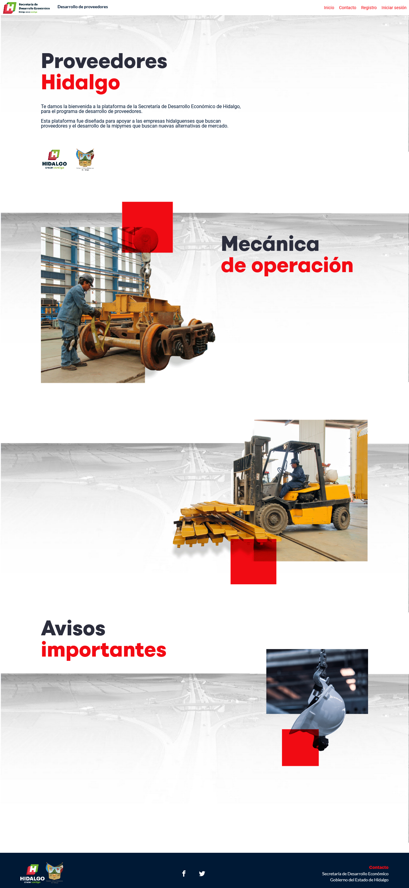

# RGT
#### Full stack Web Developer
Soy un programador apasionado por el desarrollo web.

He desarrollado difentes plataformas como:

&nbsp;

[Mi Primer Empleo, Mi Primer Salario](http://miprimerempleo.hidalgo.gob.mx/)

Página web creada para Gobierno del Estado de Hidalgo, la cual cuenta con mas de 3000 registros y ayuda a jovenes recien egresados a encontrar empleo desarrollada con técnologia VUE.

&nbsp;

[Consume Hidalgo](https://consume.hidalgo.com.mx)

Página web creada para Gobierno del Estado de Hidalgo la cual cuenta con mas de 1500 registros y mas de 20,000 visitas desarrollada en React.

&nbsp;

[Expofinanciera](http://google.com.mx)

Página web creada para Gobierno del Estado de Hidalgo sobre una expo de financiamiento la cúal conto con la presencia de 6 bancos y 3 financieras desarrollada en Angular.

[Semana Mujer MIPYME](http://semanamujermipyme.hidalgo.gob.mx/)

En este espacio virtual de asistencia y cooperación empresarial en donde empresarias, emprendedoras y todas las profesionales en general podrán encontrar información de valor para su negocio, con la finalidad de brindarles herramientas para la reactivación económica. 

[Desarrollo de proveedores](https://desarrollodeproveedores.hidalgo.gob.mx/)

Esta plataforma fue diseñada para apoyar a las empresas hidalguenses que buscan proveedores y el desarrollo de la mipymes que buscan nuevas alternativas de mercado.
                    

